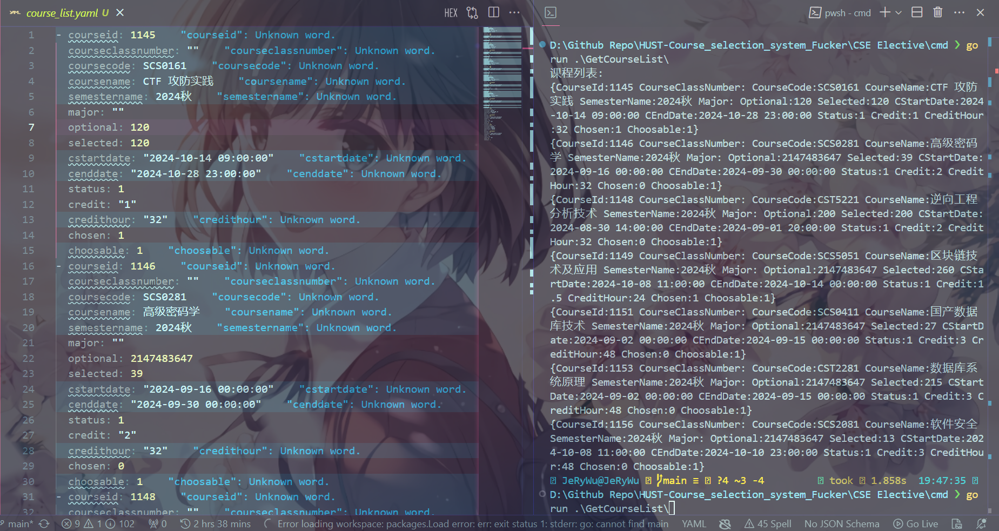
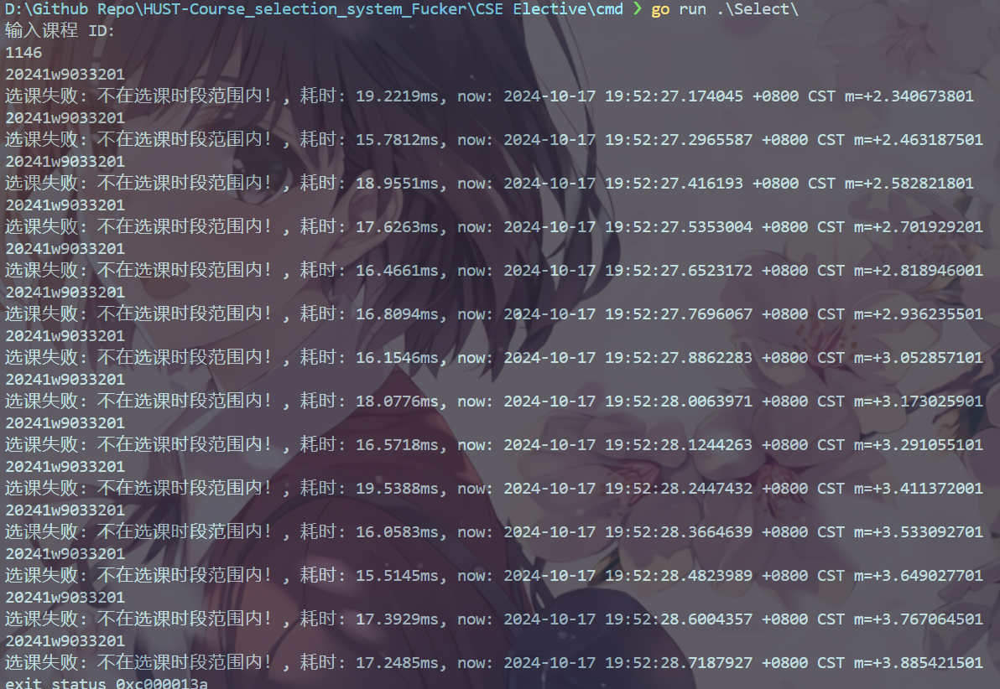

# CSE Elective 网安专选课

## 使用方式

### 获取 Token

参考[主校区公选课的方法](https://github.com/RuijieWu/HUST-OCSS-Fucker/blob/main/Public%20Elective/README.md)获取你的 Token
获取后可填入到 config/config.go 的 TOKEN 字段中以免有效期内重复输入

> 记得 Token 是有存活时间限制的，每次重新登陆或者每隔一段时间未操作的话记得更新

### 获取课程列表

```bash
# 假设当前目录为 CSE Elective 的根目录
go run ./cmd/GetCourseList/main.go
```



### 选课

```bash
# 假设当前目录为 CSE Elective 的根目录
go run ./cmd/Select/main.go
```



## Reference

很大程度上参考（照抄）了 [ncc-course-client](https://github.com/NolanHo/ncc-course-client)
