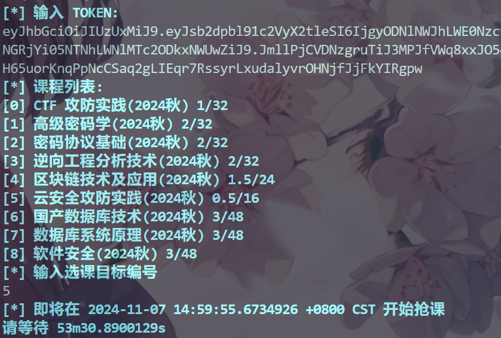

<!--
 * @Author: 7erry
 * @Date: 2024-10-17 12:55:37
 * @LastEditTime: 2024-11-07 14:10:24
 * @Description: 
-->
# CSE Elective 网安专选课

| 224.10.23 脚本抢课哥太多学院在评课平台上搞制裁了，新写了一个 Cli 把暴力发包改成卡点发,需要注意的是客户端的本地时间与选课平台服务器的本地时间是不同的，这个抢课程序会自动计算这个时间差并矫正抢课时间，误差在 1s 内，网速越快时间差算的越准

## 使用方式

### 获取 Token

参考[主校区公选课的方法](https://github.com/RuijieWu/HUST-OCSS-Fucker/blob/main/Public%20Elective/README.md)获取你的 Token
获取后可填入到 config/config.go 的 TOKEN 字段中以免有效期内重复输入

> 记得 Token 是有存活时间限制的，每次重新登陆或者每隔一段时间未操作的话记得更新

### 获取课程列表

```bash
# 假设当前目录为 CSE Elective 的根目录
go run ./cmd/GetCourseList/main.go
```


### 选课

```bash
# 假设当前目录为 CSE Elective 的根目录
go run ./cmd/Select/main.go
```


### 抢课

```bash
# 假设当前目录为 CSE Elective 的根目录
go run ./cmd/Cli/main.go
```



## ToDo

-[ ] 进行混淆处理避免被 Gank
-[ ] 尝试通过其它方式判断待选目标的接口开放情况

## Reference

很大程度上参考（照抄）了 [ncc-course-client](https://github.com/NolanHo/ncc-course-client)
